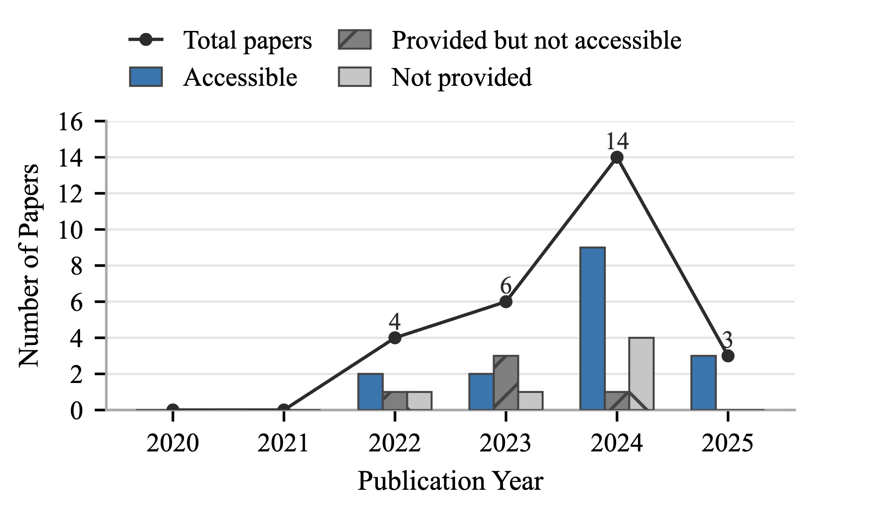
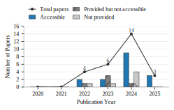

# A Systematic Literature Review of Prompt Engineering Techniques for Code Summarization

---

## Abstract
Prompt engineering has become a crucial component in effectively leveraging Large Language Models (LLMs) for software engineering tasks, particularly code summarization.  
This review systematically examines **prompt-based LLM techniques (2020–2025)**, analyzing strategies such as **Zero-shot, Few-shot, RAG, and Chain-of-Thought prompting**, and their roles across **granularity levels** (function, module, repository).  
Our findings synthesize insights from **27 peer-reviewed studies**, revealing how prompt design influences summary quality, reproducibility, and evaluation robustness.  
We also provide a taxonomy of prompt engineering strategies and discuss open challenges in reproducibility, standardization, and multi-language code summarization.

---
## 📊 Visualizations

### 1. Distribution of Prompting Paradigms Across Studies

### 2. Programming Language Coverage

### 3. LLM Family Trend (2020–2025)

### 4. Artifact Sharing Landscape

### 5. Venue Distribution

### 6. Publication Year Distribution

### 7. Replication and Availability by Year

### 8. Alignment Strength Distribution

