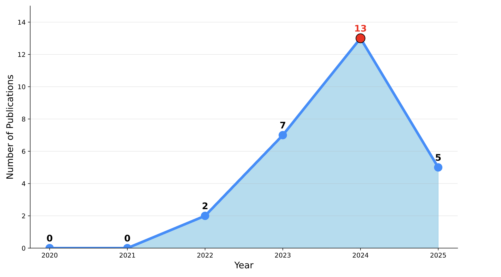
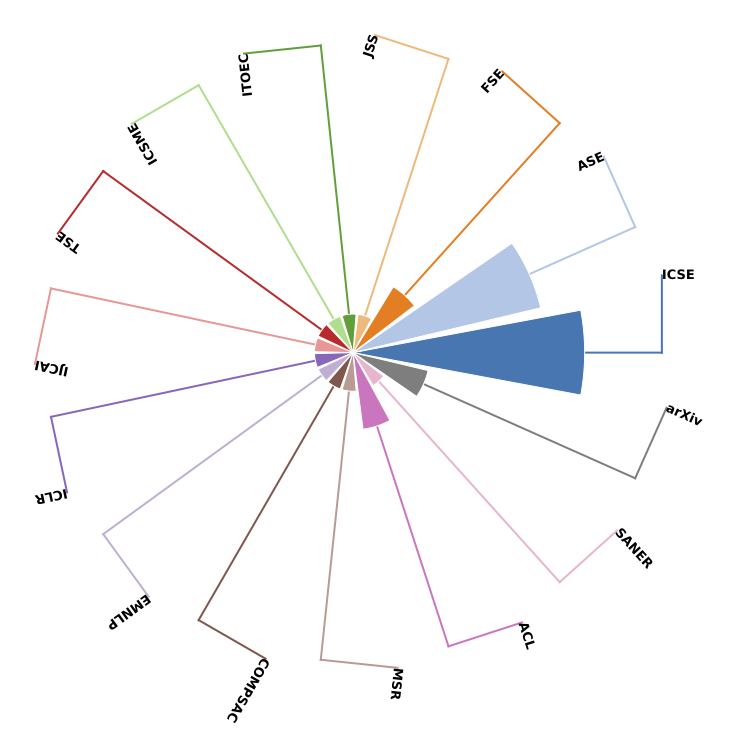
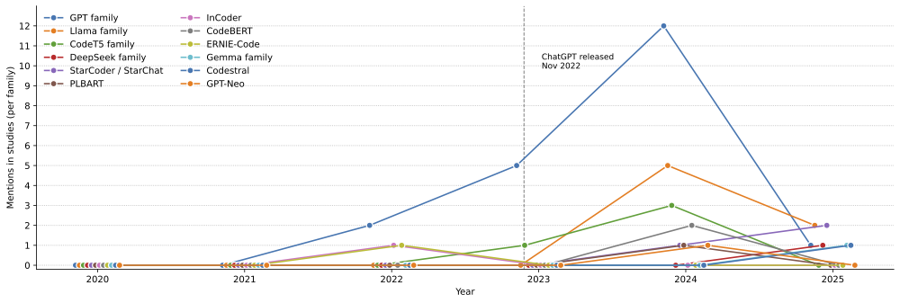
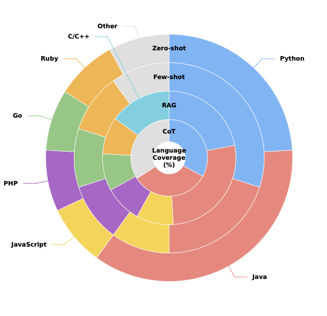
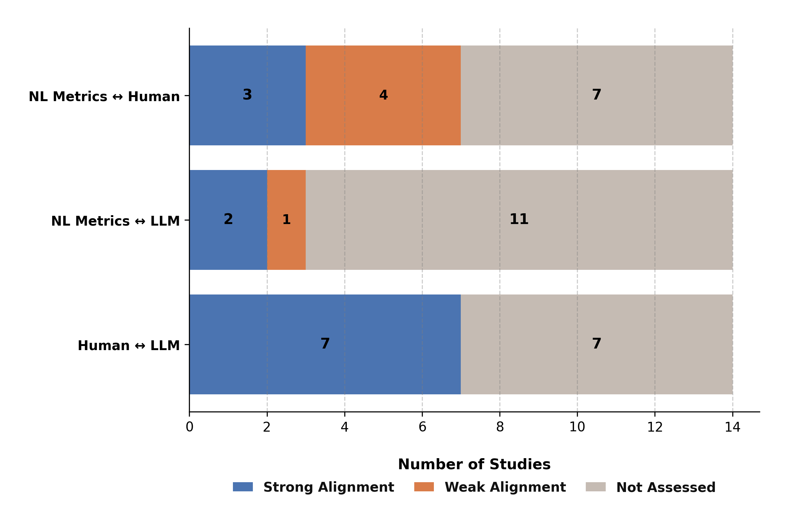
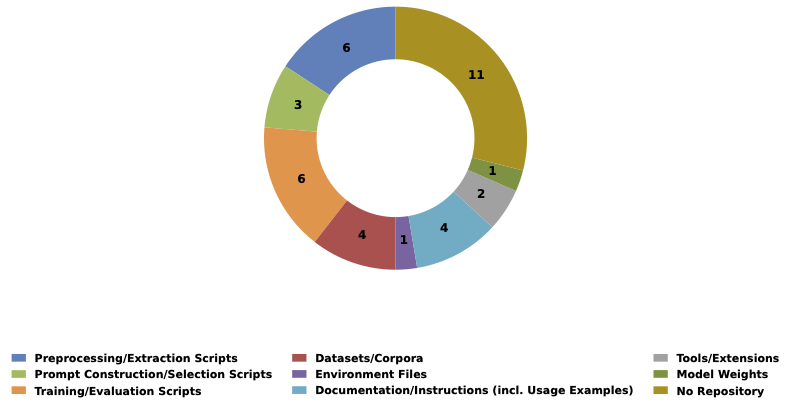

# A Systematic Literature Review of Prompt Engineering Techniques for Code Summarization

---

## Abstract
Prompt engineering has become a crucial component in effectively leveraging Large Language Models (LLMs) for software engineering tasks, particularly code summarization.  
This review systematically examines **prompt-based LLM techniques (2020–2025)**, analyzing strategies such as **Zero-shot, Few-shot, RAG, and Chain-of-Thought prompting**, and their roles across **granularity levels** (function, module, repository).  
Our findings synthesize insights from **27 peer-reviewed studies**, revealing how prompt design influences summary quality, reproducibility, and evaluation robustness.  
We also provide a taxonomy of prompt engineering strategies and discuss open challenges in reproducibility, standardization, and multi-language code summarization.

---

## 📊 Visualizations

### 1. Overview Summary Figure

**Figure2:** Study selection process for the systematic review on prompt-based code summarization. 
The pipeline includes four stages: (i) identification and filtering,
(ii) screening, (iii) snowballing/manual addition, and (iv) synthesis of findings.

### 2. Publication Year Distribution

**Figure3:** Papers published per year (2020–2025).

### 3. Venue Distribution

**Figure4:** Venue distribution of prompt engineering techniques in code summarization.

### 4. LLM Family Trend (2020–2025)

**Figure6:** Trend of LLM family adoption across code-summarization studies (2020–2025). The trend highlights a gradual diversification of model adoption, reflecting the community’s increasing emphasis on transparency, reproducibility, and open-source alternatives.

### 5. Programming Language Coverage

**Figure7:** Distribution of programming languages across 27 prompt-based code summarization studies. Each ring represents a prompting paradigm (Zero-shot, Few-shot, RAG, Chain-of-Thought), and each colored segment corresponds to a programming language, illustrating the dominance of Python and Java benchmarks across paradigms.

### 6. Alignment Strength Distribution

**Figure8:** Distribution of strategies by metric–human alignment category alongside key quality dimensions emphasized in human evaluation. The chart shows the number of strategies exhibiting strong or moderate correlation between automated metrics and human judgments.

### 7. Artifact Sharing Landscape

**Figure9:** Artifact-sharing landscape across 27 studies. Preprocessing and training scripts are the most frequently shared artifacts, followed by datasets and documentation resources.

### 8. Replication and Availability by Year

**Figure10:** Year-wise availability of replication packages in primary studies (2020–2025). Bars show *Accessible*, *Provided but not accessible*, and *Not provided* packages; the line indicates the total number of papers.


## 📂 Repository Structure

- **/Prompt-Engineering_SLR/**
  - **/Filter/** → Excel files and scripts used for filtering primary studies  
  - **/Plot_Script/** → Python scripts that generate all visualization figures  
  - **/Visualization_Image/** → All final PNG/SVG/PDF figures used in the README  
- **README.md** → Overview of the project and all visualizations  
- **(Other project files you uploaded earlier)**


## 🔄 How to Reproduce

1. **Clone the repository**
   ```bash
   git clone https://github.com/afia2023/prompt-engineering.git
   cd prompt-engineering
pip install -r requirements.txt


