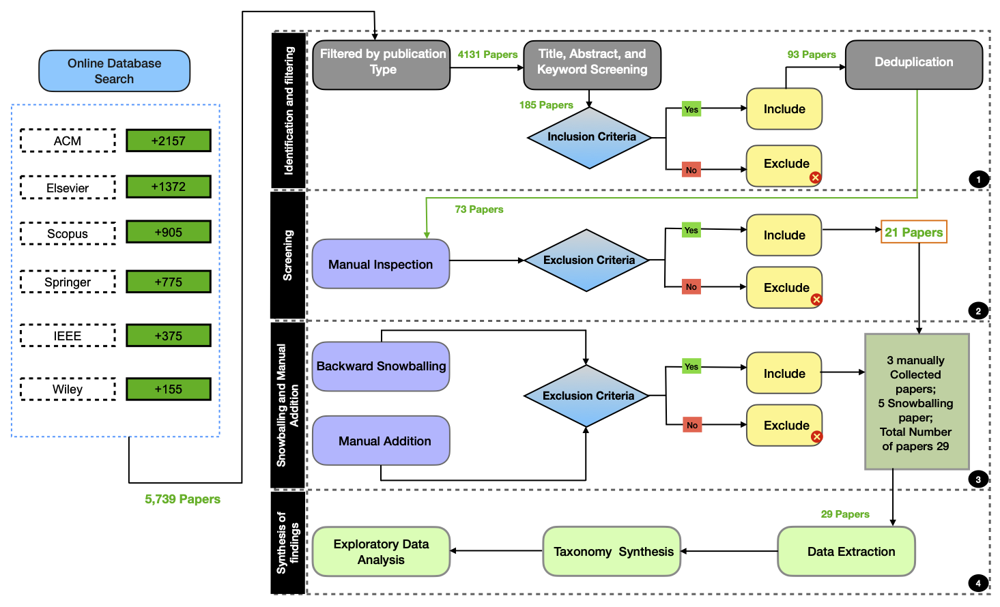
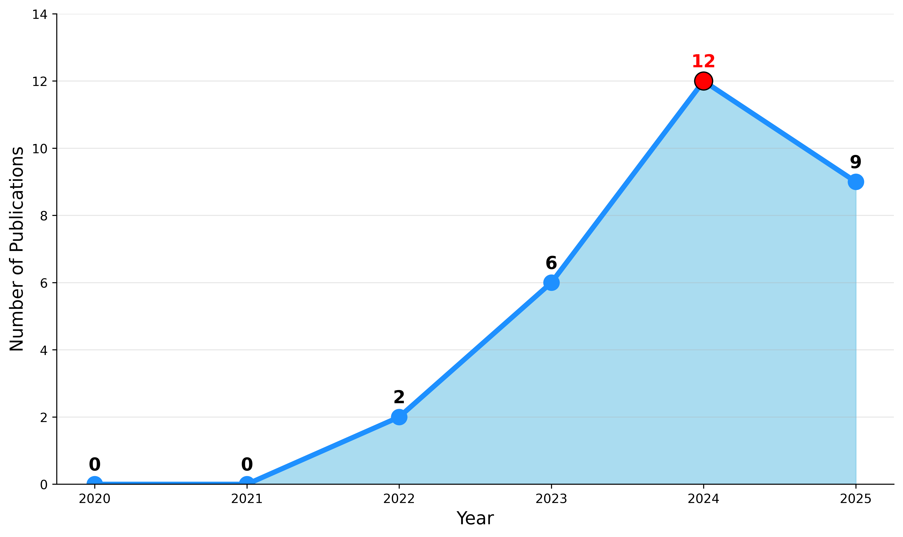
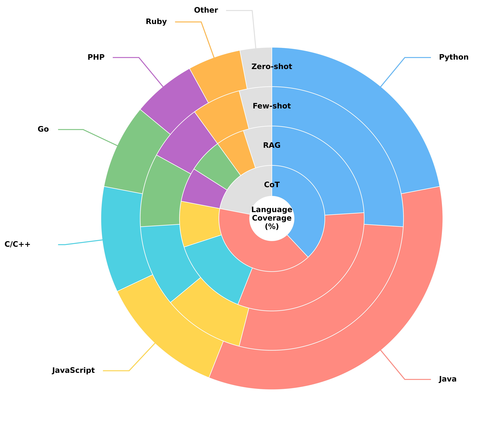
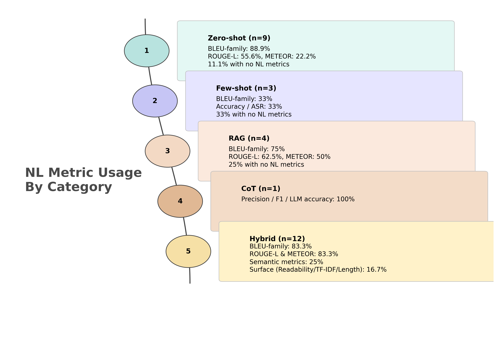
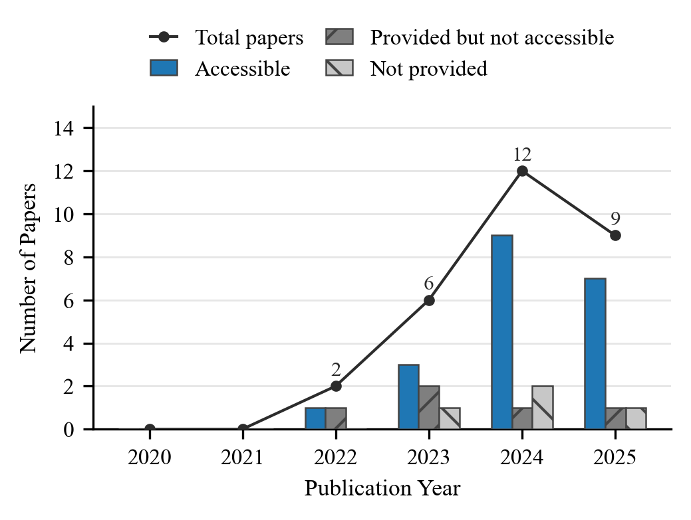

# A Systematic Literature Review of Prompt Engineering Techniques for Code Summarization

---

## Abstract
Software documentation is essential for program comprehension, developer onboarding, code review, and long-term maintenance. Yet producing quality documentation manually is time-consuming and frequently yields incomplete or inconsistent results. Large language models (LLMs) offer a promising solution by automatically generating natural language descriptions from source code. LLMs can streamline various documentation tasks, helping developers understand code more efficiently, facilitating maintenance, and supporting downstream activities such as defect localization and commit message generation. However, the effectiveness of LLMs in such tasks critically depends on how they are prompted. Properly structured instructions can substantially improve model performance, making \textit{prompt engineering}--the design of input prompts to guide model behavior--a foundational technique in LLM-based software engineering. While approaches such as few-shot prompting and chain-of-thought reasoning show potential, current research remains fragmented, and there is limited understanding of which prompting strategies work best, for which models, and under what conditions.
This paper presents the first systematic literature review of prompt-driven code summarization. We screened 5,739 publications and analyzed 29 primary studies published between 2020 and 2025. Our review introduces a taxonomy of prompt engineering strategies, maps them to different code types, comments on their empirical effectiveness, and examines reproducibility practices. This synthesis provides a comprehensive reference for researchers and practitioners seeking to advance effective, prompt-based code summarization.

---

## 📊 Visualizations

### 1. Overview Summary Figure

**Figure2:** Study selection process for the systematic review on prompt-based code summarization. 
The pipeline includes four stages: (i) identification and filtering,
(ii) screening, (iii) snowballing/manual addition, and (iv) synthesis of findings.

### 2. Publication Year Distribution

**Figure3:** Papers published per year (2020–2025).

### 3. Venue Distribution

**Figure4:** Venue distribution of prompt engineering techniques in code summarization.

### 4. LLM Family Trend (2020–2025)

**Figure6:** Trend of LLM family adoption across code-summarization studies (2020–2025). The trend highlights a gradual diversification of model adoption, reflecting the community’s increasing emphasis on transparency, reproducibility, and open-source alternatives.

### 5. Programming Language Coverage

**Figure7:** Distribution of programming languages across 27 prompt-based code summarization studies. Each ring represents a prompting paradigm (Zero-shot, Few-shot, RAG, Chain-of-Thought), and each colored segment corresponds to a programming language, illustrating the dominance of Python and Java benchmarks across paradigms.

### 5. Natural language metrics distribution

**Figure8:** Distribution of NL evaluation metrics across prompting paradigms.

### 6. Alignment Strength Distribution

**Figure9:** Distribution of strategies by metric–human alignment category alongside key quality dimensions emphasized in human evaluation. The chart shows the number of strategies exhibiting strong or moderate correlation between automated metrics and human judgments.

### 7. Artifact Sharing Landscape

**Figure10:** Artifact-sharing landscape across 27 studies. Preprocessing and training scripts are the most frequently shared artifacts, followed by datasets and documentation resources.

### 8. Replication and Availability by Year

**Figure11:** Year-wise availability of replication packages in primary studies (2020–2025). Bars show *Accessible*, *Provided but not accessible*, and *Not provided* packages; the line indicates the total number of papers.


## 📂 Repository Structure

- **/Prompt-Engineering_SLR/**
  - **/Filter/** → Excel files and scripts used for filtering primary studies  
  - **/Plot_Script/** → Python scripts that generate all visualization figures  
  - **/Visualization_Image/** → All final PNG/SVG/PDF figures used in the README  
- **README.md** → Overview of the project and all visualizations  


## 🔄 How to Reproduce

1. **Clone the repository**
   ```bash
   git clone https://github.com/afia2023/prompt-engineering.git
   cd prompt-engineering
2. ``` pip install -r requirements.txt```


